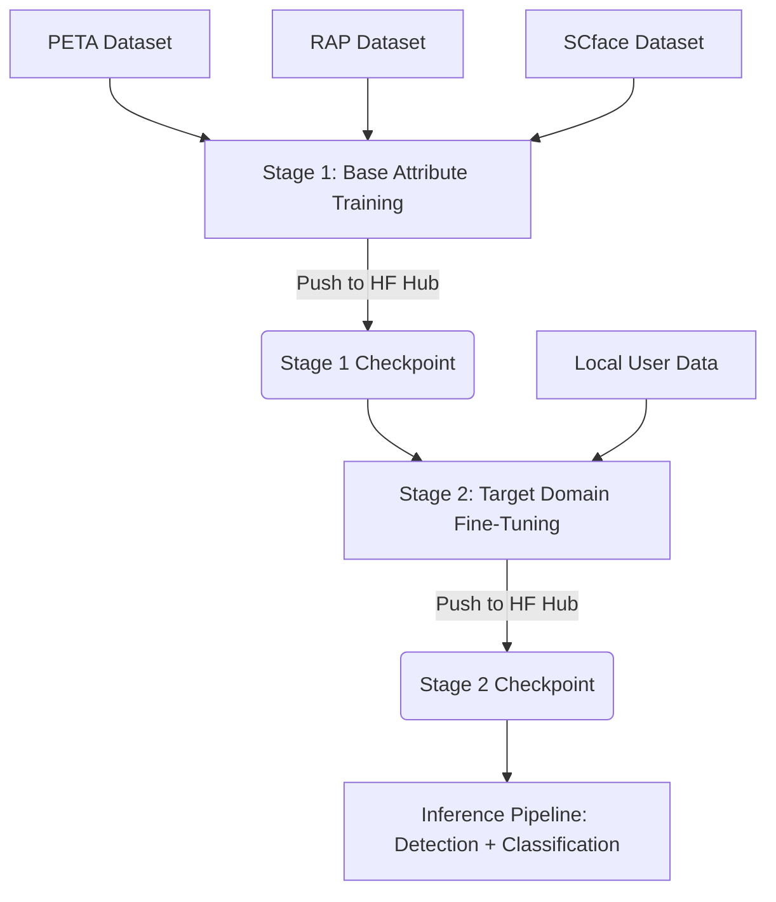

# Footfall Analysis: Gender Model Training

This repository contains the training pipeline to fine-tune a Vision Transformer (ViT) model for gender classification as part of a larger Footfall Analysis system. The system leverages a two-stage training approach to achieve high classification accuracy on pedestrian images.

## Overview

The gender classification pipeline is built on a pure vision transformer backbone (`google/vit-base-patch16-224`) pre-trained on ImageNet-21k. Instead of multi-modal architectures (such as CLIP), a dedicated vision model is used to preserve features and optimize performance on visual classification tasks.

The training pipeline consists of two distinct stages:



### Why ViT over CLIP for classification?
- **Vision-Only Focus**: CLIP is a vision-language model. Fine-tuning it for a binary gender head discards the text encoder, reducing a large multi-modal architecture to a simple classifier. 
- **Efficiency and Specialization**: ViT acts as a pure, high-performance vision backbone. It is better suited for fine-tuning on structural pedestrian attributes.
- **Role of CLIP**: CLIP is used only once during the SCface preprocessing stage as a method to generate initial auto-labels for correction. It is not used in the training or inference loop.

---

## Repository Layout

```
├── docs/
│   └── training.md             # Detailed guide explaining stages and tuning strategies
├── src/
│   └── training/
│       ├── __init__.py
│       ├── datasets.py         # PyTorch Dataset definitions for PETA, RAP, and SCface
│       ├── model.py            # GenderClassifier model definition (ViT backbone + Linear head)
│       ├── trainer.py          # Custom trainer logic supporting linear probing and full fine-tuning
│       └── transforms.py       # Data augmentation and preprocessing transforms
├── tests/
│   ├── __init__.py
│   └── test_training.py        # Unit tests for training components
├── scripts/
│   └── download_datasets.md    # Instructions and links to download baseline datasets
├── train_stage1.ipynb          # Notebook for Stage 1 base training
├── train_stage2.ipynb          # Notebook for Stage 2 target fine-tuning
├── test_model.ipynb            # Notebook for evaluating checkpoint on images/videos
├── requirements.txt            # Python dependencies
└── README.md                   # Project documentation
```

---

## Notebook Guide

This repository contains three main notebooks to execute the workflow:

| Notebook | Purpose | Usage Frequency |
| :--- | :--- | :--- |
| `train_stage1.ipynb` | Train on PETA, RAP, and SCface datasets. Push the best checkpoint to the Hugging Face Hub. | Once (or during major retraining runs). |
| `train_stage2.ipynb` | Load the Stage 1 checkpoint from the Hugging Face Hub. Fine-tune on your specific local domain data. Push the updated checkpoint back to the Hub. | Whenever new labeled target data is collected. |
| `test_model.ipynb` | Load the final Stage 2 checkpoint from the Hugging Face Hub. Test the model performance on images and videos. | Every time you need to evaluate or verify model changes. |

---

## Training Strategy

### Stage 1: Base Attribute Training
This stage trains the model on public pedestrian datasets (PETA, RAP, and SCface) to establish strong baseline features.

1. **Phase A (Linear Probe)**:
   - **Configuration**: Backbone frozen, classification head active.
   - **Learning Rate**: 1e-3.
   - **Duration**: 3 epochs.
   - **Goal**: Warm up the new linear classification head without modifying pre-trained ViT weights.

2. **Phase B (Full Fine-Tuning)**:
   - **Configuration**: Backbone unfrozen, end-to-end training.
   - **Learning Rate**: 1e-5 with cosine decay and a 10% warmup phase.
   - **Duration**: 10 epochs.
   - **Goal**: Fine-tune the entire network for pedestrian gender attributes.

The best checkpoint is pushed directly to the Hugging Face Hub (e.g., `abhshkp/footfall-analysis-vit-stage1`).

### Stage 2: Target Domain Fine-Tuning
This stage adapts the pre-trained Stage 1 model to your specific domain (such as local CCTV cameras or store entrances) using a smaller dataset and a lower learning rate to prevent catastrophic forgetting.

1. **Phase A (Linear Probe)**:
   - **Configuration**: Backbone frozen.
   - **Learning Rate**: 1e-4 (one-tenth of Stage 1).
   - **Duration**: 2 epochs.

2. **Phase B (Full Fine-Tuning)**:
   - **Configuration**: Backbone unfrozen.
   - **Learning Rate**: 1e-6 (one-tenth of Stage 1).
   - **Duration**: 5 epochs.

---

## Dataset Layout

To train Stage 1, download the PETA, RAP, and SCface datasets as detailed in `scripts/download_datasets.md`.
To train Stage 2, prepare your local dataset in the following directory format:

```
data/
└── user/
    ├── male/
    │   ├── img001.jpg
    │   ├── img002.jpg
    │   └── ...
    └── female/
        ├── img003.jpg
        ├── img004.jpg
        └── ...
```

### Dataset Summary

| Dataset | Sample Count | Label Source |
| :--- | :--- | :--- |
| PETA | ~19,000 | `personalMale` attributes |
| RAP | ~42,000 | Gender column in `RAP_annotation.mat` |
| SCface | ~4,160 | Auto-labeled via CLIP (with manual verification) |
| Local User Data | Variable | Hand-labeled by organizing into folders |

---

## Quick Start

### 1. Installation
Install the required dependencies:
```bash
pip install -r requirements.txt
```

### 2. Testing the Model
If you already have a trained checkpoint uploaded to Hugging Face:
1. Open the `test_model.ipynb` notebook.
2. Update the repository name:
   ```python
   HF_REPO = "abhshkp/footfall-analysis-vit-stage1"
   ```
3. Run the notebook cells to upload a test video and get an annotated MP4 output.

### 3. Running Stage 2 Fine-Tuning
1. Open the `train_stage2.ipynb` notebook.
2. Configure the source Stage 1 repository:
   ```python
   hf_repo = "abhshkp/footfall-analysis-vit-stage1"
   ```
3. Upload your labeled dataset under `data/user/male/` and `data/user/female/`.
4. Run all cells to fine-tune the model and push the new checkpoint to your target Hugging Face repository.

---

## Model Serialization and Checkpoints

Since trained checkpoints are large (approximately 340 MB) and exceed the GitHub file size limit, they are managed outside Git.

### Hugging Face Hub (Recommended)
You can push and pull checkpoints directly to the Hugging Face Hub using the Hugging Face CLI:

```bash
# Log in to your Hugging Face account
huggingface-cli login

# Upload a local checkpoint
huggingface-cli upload abhshkp/footfall-analysis-vit-stage1 checkpoints/stage1/best --repo-type=model

# Download the checkpoint to a local directory
huggingface-cli download abhshkp/footfall-analysis-vit-stage1 --local-dir checkpoints/stage1/best
```

### Google Drive
Alternatively, you can mount Google Drive in your Colab environment and save checkpoints directly to a shared folder:
```python
from google.colab import drive
drive.mount('/content/drive')
```
Saved checkpoints are stored in `/content/drive/MyDrive/IPD_checkpoints/`.
