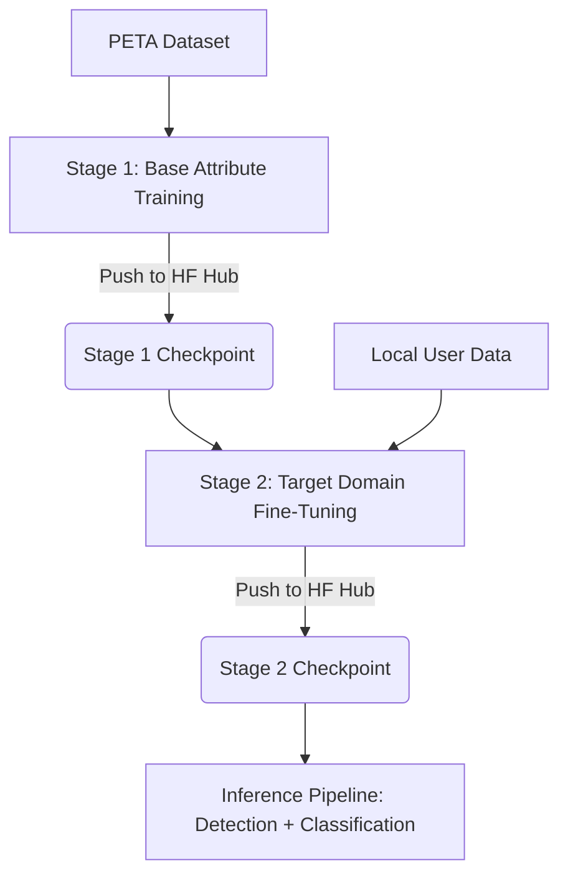
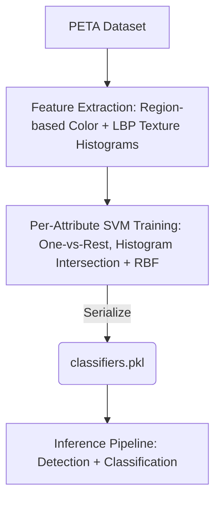

# Footfall Analysis: Gender Model Training & Age Classification

This repository contains the training pipeline to fine-tune a Vision Transformer (ViT) model for gender classification as part of a larger Footfall Analysis system. The system leverages a two-stage training approach to achieve high classification accuracy on pedestrian images.

## Overview

The gender classification pipeline is built on a pure vision transformer backbone (`google/vit-base-patch16-224`) pre-trained on ImageNet-21k. Instead of multi-modal architectures (such as CLIP), a dedicated vision model is used to preserve features and optimize performance on visual classification tasks.

The training pipeline consists of two distinct stages:



The age classification pipeline takes a different approach: it replicates the original PETA benchmark methodology (Deng et al., 2014) using classical computer vision, region based color and texture histograms as features, with one independent SVM per age attribute (one vs rest). There is no fine-tuning stage; the model is trained once on PETA and serialized directly.



### Why ViT over CLIP for classification for Gender Classification?
- **Vision-Only Focus**: CLIP is a vision-language model. Fine-tuning it for a binary gender head discards the text encoder, reducing a large multi-modal architecture to a simple classifier. 
- **Efficiency and Specialization**: ViT acts as a pure, high-performance vision backbone. It is better suited for fine-tuning on structural pedestrian attributes.

### Why classical color and texture features with SVMs for Age Classification?
- **Faithful Reproduction**: The age model replicates the documented PETA benchmark methodology exactly, region-based color and texture histograms as features, one histogram-intersection-kernel SVM per attribute (one vs rest), evaluated with per-attribute mean Accuracy (mA), so results stay directly comparable to the published baseline instead of a deep learning approach.
- **No CNNs, No Ensembling**: The pipeline deliberately avoids deep learning and ensembling, using classical computer vision features and per-attribute SVMs, selected by grid search over a histogram-intersection kernel and an RBF kernel.

---

## Documentation

- **Architecture Diagrams**: For detailed flowcharts of the inference pipeline and internal model structure, see the [Architecture Overview](file:///e:/projects/Footfall-Analysis/docs/architecture/README.md).
- **Fine-Tuning Guide**: For a detailed explanation of tuning stages, learning rates, and dataset configuration, see [training.md](file:///e:/projects/Footfall-Analysis/docs/training.md).
- **Age Model Guide**: For the classical computer vision pipeline used for age classification (feature extraction, per-attribute SVMs), see the Age Attribute Model section in [training.md](file:///e:/projects/Footfall-Analysis/docs/training.md) and the `age_classifier_v3.ipynb` notebook.

---

## Repository Layout

```
├── docs/
│   ├── architecture/
│   │   ├── README.md           # Architecture diagrams overview and explanation
│   │   ├── gender_model_architecture.mmd # Gender model architecture diagram (Mermaid)
│   │   └── age_model_architecture.mmd    # Age model architecture diagram (Mermaid)
│   └── training.md             # Detailed guide explaining stages and tuning strategies
├── src/
│   └── training/
│       ├── __init__.py
│       ├── datasets.py         # PyTorch Dataset definitions for PETA and stage-2 user data
│       ├── model.py            # GenderClassifier model definition (ViT backbone + Linear head)
│       ├── trainer.py          # Custom trainer logic supporting linear probing and full fine-tuning
│       └── transforms.py       # Data augmentation and preprocessing transforms
├── tests/
│   ├── __init__.py
│   └── test_training.py        # Unit tests for training components
├── scripts/
│   └── download_datasets.md    # Instructions and links to download baseline datasets
├── train_stage1.ipynb          # Notebook for Stage 1 base training
├── train_stage2.ipynb          # Notebook for Stage 2 target fine-tuning
├── test_model.ipynb            # Notebook for evaluating checkpoint on images/videos
├── age_classifier_v3.ipynb     # Notebook for training and evaluating the age attribute model (classical CV + SVM)
├── requirements.txt            # Python dependencies
└── README.md                   # Project documentation
```

---

## Notebook Guide

This repository contains three main notebooks to execute the workflow:

| Notebook | Purpose | Usage Frequency |
| :--- | :--- | :--- |
| `train_stage1.ipynb` | Train on PETA dataset. Push the best checkpoint to the Hugging Face Hub. | Once (or during major retraining runs). |
| `train_stage2.ipynb` | Load the Stage 1 checkpoint from the Hugging Face Hub. Fine-tune on your specific local domain data. Push the updated checkpoint back to the Hub. | Whenever new labeled target data is collected. |
| `test_model.ipynb` | Load the final Stage 2 checkpoint from the Hugging Face Hub. Test the model performance on images and videos. | Every time you need to evaluate or verify model changes. |
| `age_classifier_v3.ipynb` | Extract region-based color and texture histogram features from PETA, train one SVM per age attribute (one vs rest), evaluate with per-attribute mean Accuracy (mA), and test on a video via person detection + crop classification. | Once (or during major retraining runs). |

---

## Training Strategy

### Stage 1: Base Attribute Training
This stage trains the model on the public PETA pedestrian dataset to establish strong baseline features.

1. **Phase A (Linear Probe)**:
   - **Configuration**: Backbone frozen, classification head active.
   - **Learning Rate**: 1e-3.
   - **Duration**: 3 epochs.
   - **Goal**: Warm up the new linear classification head without modifying pre-trained ViT weights.

2. **Phase B (Full Fine-Tuning)**:
   - **Configuration**: Backbone unfrozen, end-to-end training.
   - **Learning Rate**: 1e-5 with cosine decay and a 10% warmup phase.
   - **Duration**: 10 epochs.
   - **Goal**: Fine-tune the entire network for pedestrian gender attributes.

The best checkpoint is pushed directly to the Hugging Face Hub (e.g., `abhshkp/footfall-analysis-vit-stage1`).

### Stage 2: Target Domain Fine-Tuning
This stage adapts the pre-trained Stage 1 model to your specific domain (such as local CCTV cameras or store entrances) using a smaller dataset and a lower learning rate to prevent catastrophic forgetting.

1. **Phase A (Linear Probe)**:
   - **Configuration**: Backbone frozen.
   - **Learning Rate**: 1e-4 (one-tenth of Stage 1).
   - **Duration**: 2 epochs.

2. **Phase B (Full Fine-Tuning)**:
   - **Configuration**: Backbone unfrozen.
   - **Learning Rate**: 1e-6 (one-tenth of Stage 1).
   - **Duration**: 5 epochs.

### Age Attribute Model: Classical CV + Per-Attribute SVMs
This model classifies pedestrians into four age buckets (`Age16-30`, `Age31-45`, `Age46-60`, `AgeAbove61`) by replicating the original PETA paper baseline. There are no linear probe or full fine-tuning phases, it is a single-stage classical pipeline trained once on PETA.

1. **Feature Extraction**:
   - Each image is split into horizontal body regions.
   - Per region: 16-bin RGB and HSV color histograms plus a uniform LBP texture histogram (radii 1, 2, 3), all L1-normalized.
   - Regions are concatenated into one feature vector per image.

2. **Per-Attribute SVM Training**:
   - One independent SVM is trained per age attribute (one vs rest).
   - Both a histogram-intersection kernel and an RBF kernel are grid searched over `C` and `gamma`, and the best configuration per attribute is chosen using validation mA.
   - Evaluated on the held-out PETA test split with per-attribute mean Accuracy (mA), achieving an average mA of roughly 0.835.

The best classifiers per attribute are serialized directly to `classifiers.pkl` (not pushed to the Hugging Face Hub).

---

## Dataset Layout

To train Stage 1, download the PETA dataset as detailed in `scripts/download_datasets.md`.
To train Stage 2, prepare your local dataset in the following directory format:

```
data/
└── user/
    ├── male/
    │   ├── img001.jpg
    │   ├── img002.jpg
    │   └── ...
    └── female/
        ├── img003.jpg
        ├── img004.jpg
        └── ...
```

The same PETA dataset is also used to train the age model, using the `personalLess30`, `personalLess45`, `personalLess60`, and `personalLarger60` attributes (mapped to `Age16-30`, `Age31-45`, `Age46-60`, and `AgeAbove61` respectively; `personalLess15` is dropped since it does not fit any of these buckets).

### Dataset Summary

| Dataset | Sample Count | Label Source |
| :--- | :--- | :--- |
| PETA | ~19,000 | `personalMale` attributes |
| PETA (age attributes) | ~14,000 | `personalLess30` / `personalLess45` / `personalLess60` / `personalLarger60` attributes |
| Local User Data | Variable | Hand-labeled by organizing into folders |

---

## Quick Start

### 1. Installation
Install the required dependencies:
```bash
pip install -r requirements.txt
```

### 2. Testing the Model
If you already have a trained checkpoint uploaded to Hugging Face:
1. Open the `test_model.ipynb` notebook.
2. Update the repository name:
   ```python
   HF_REPO = "abhshkp/footfall-analysis-vit-stage1"
   ```
3. Run the notebook cells to upload a test video and get an annotated MP4 output.

### 3. Running Stage 2 Fine-Tuning
1. Open the `train_stage2.ipynb` notebook.
2. Configure the source Stage 1 repository:
   ```python
   hf_repo = "abhshkp/footfall-analysis-vit-stage1"
   ```
3. Upload your labeled dataset under `data/user/male/` and `data/user/female/`.
4. Run all cells to fine-tune the model and push the new checkpoint to your target Hugging Face repository.

### 4. Running the Age Classifier
1. Open the `age_classifier_v3.ipynb` notebook.
2. Mount Google Drive and set `PETA_ROOT` to your extracted PETA dataset (skip the mount step if running locally).
3. Run all cells to extract features, train one SVM per age attribute, and evaluate on the held-out test split using per-attribute mean Accuracy (mA).
4. Optionally upload a video to test detection plus age classification end to end; the notebook writes an annotated `output_video.mp4`.
5. The trained classifiers are saved to `classifiers.pkl`.

---

## Model Serialization and Checkpoints

Since trained checkpoints are large (approximately 340 MB) and exceed the GitHub file size limit, they are managed outside Git.

### Hugging Face Hub (Recommended)
You can push and pull checkpoints directly to the Hugging Face Hub using the Hugging Face CLI:

```bash
# Log in to your Hugging Face account
huggingface-cli login

# Upload a local checkpoint
huggingface-cli upload abhshkp/footfall-analysis-vit-stage1 checkpoints/stage1/best --repo-type=model

# Download the checkpoint to a local directory
huggingface-cli download abhshkp/footfall-analysis-vit-stage1 --local-dir checkpoints/stage1/best
```

### Google Drive
Alternatively, you can mount Google Drive in your Colab environment and save checkpoints directly to a shared folder:
```python
from google.colab import drive
drive.mount('/content/drive')
```
Saved checkpoints are stored in `/content/drive/MyDrive/IPD_checkpoints/`.

### Age Model Classifiers
The age model's classifiers are much smaller than the ViT checkpoints and are saved as a pickled dictionary of per-attribute SVMs (`classifiers.pkl`, roughly 79 MB, about 35 MB zipped). They can be shared the same way as the gender checkpoints, via the Hugging Face Hub, Google Drive, or a direct pickle transfer.
