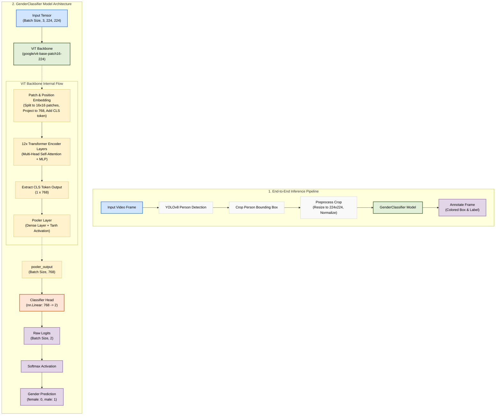
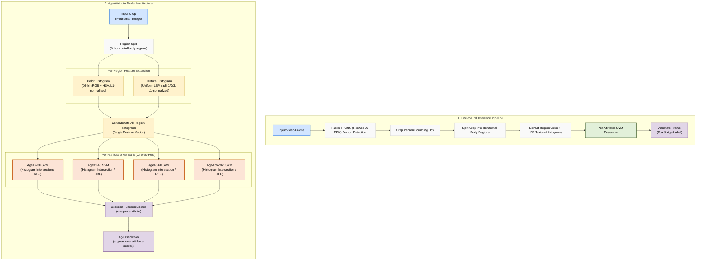

# Architecture Diagrams

This directory contains architecture diagrams for the components of the Footfall Analysis project.

## Gender Model Architecture

The gender model is a binary classifier based on a Vision Transformer (ViT) backbone. It is implemented in [model.py](file:///e:/projects/Footfall-Analysis/src/training/model.py) as the [GenderClassifier](file:///e:/projects/Footfall-Analysis/src/training/model.py#L9) class.

### 1. End-to-End Inference Pipeline
During video inference, we combine person detection with gender classification:
1. **Person Detection**: YOLOv8n detects persons in each video frame.
2. **Crop & Preprocess**: The bounding boxes are cropped and resized to $224 \times 224$ pixels, then normalized using ImageNet mean/standard deviation.
3. **Gender Classification**: The preprocessed crop is passed through the `GenderClassifier` model to predict the gender (`female` or `male`).
4. **Annotation**: The frame is annotated with bounding boxes (colored by gender) and labels.

### 2. Model Architecture
- **Backbone**: `google/vit-base-patch16-224` (Vision Transformer).
- **Classification Head**: A single Linear layer mapping the pooler output ($768 \to 2$).

### Diagram

Here is the architecture flowchart. You can view the raw mermaid source code in [gender_model_architecture.mmd](file:///e:/projects/Footfall-Analysis/docs/architecture/gender_model_architecture.mmd).

## Age Model Architecture

The age model is a four-class classifier based on classical computer vision features (color and texture histograms) with one SVM per age attribute. It is implemented in the `age_classifier_v3.ipynb` notebook, replicating the original PETA benchmark methodology (Deng et al., 2014) rather than a dedicated `model.py` class.

### 1. End-to-End Inference Pipeline
During video inference, we combine person detection with age classification:
1. **Person Detection**: A Faster R-CNN (ResNet-50 FPN) detector detects persons in each video frame.
2. **Crop & Region Split**: Each bounding box is cropped, then split into horizontal body regions.
3. **Feature Extraction**: Per region, 16-bin RGB and HSV color histograms plus a uniform LBP texture histogram are computed and L1-normalized, then concatenated into one feature vector per crop.
4. **Age Classification**: The feature vector is scored by all four per-attribute SVMs (`Age16-30`, `Age31-45`, `Age46-60`, `AgeAbove61`); the attribute with the highest decision function score is predicted.
5. **Annotation**: The frame is annotated with bounding boxes and the predicted age label.

### 2. Model Architecture
- **Features**: Region-based 16-bin RGB and HSV color histograms plus uniform LBP texture histograms (radii 1, 2, 3), all L1-normalized and concatenated across regions.
- **Classification Heads**: Four independent one-vs-rest SVMs, one per age bucket, each using either a histogram-intersection kernel or an RBF kernel (selected per attribute via grid search over `C` and `gamma`).
- **Decision Rule**: The age bucket whose SVM produces the highest decision function score is chosen as the final prediction.

### Diagram

Here is the architecture flowchart. You can view the raw mermaid source code in [age_model_architecture.mmd](file:///e:/projects/Footfall-Analysis/docs/architecture/age_model_architecture.mmd).

