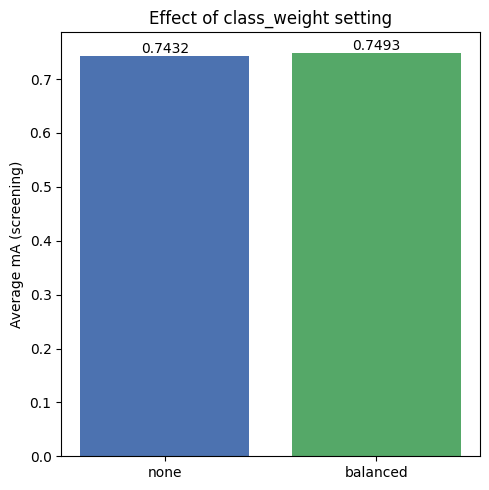

# Class Weighting Sensitivity Analysis

An analysis of the effects of the `class_weight` setting used during SVM training in the Pure SVM age classification baseline on the PETA dataset.

## Experiment Configuration
- **Tested Values:** `none`, `balanced`
- **Evaluation:** Average mA (screening) recorded for each setting on a 30% subsample of the training and validation data, holding all other chosen feature settings (`N_REGIONS=4`, `COLOR_BINS=16`, `LBP_POINTS=16`, `LBP_RADII=[1,2,3]`) fixed.

## Observations

- **No Weighting:**
  Achieved an average mA of **0.7432**.

- **Balanced Weighting:**
  Achieved a clearly higher average mA of **0.7493**, a difference of roughly 0.6 percentage points.

- **Analysis:**
  This confirms that explicitly compensating for the imbalance between age buckets during SVM training meaningfully helps the model, consistent with the imbalance observed earlier in the dataset (Age31-45 and Age16-30 together making up the large majority of samples).

## Effect Visualization

Below is the accuracy comparison between the two class-weighting settings:

---

## Conclusion & Recommendation

> [!IMPORTANT]
> **Optimal Value: `balanced`**
>
> Balanced class weighting is recommended, as it meaningfully improves screening accuracy (0.7493 vs. 0.7432) by compensating for the imbalance between age buckets in the PETA dataset.
