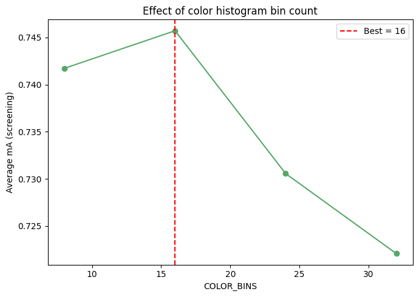

# Color Histogram Bin Count Sensitivity Analysis

An analysis of the effects of the color histogram bin count (`COLOR_BINS`) used for region-based color feature extraction in the Pure SVM age classification baseline on the PETA dataset.

## Experiment Configuration
- **Tested Values:** `8, 16, 24, 32`
- **Evaluation:** Average mA (screening) recorded for each value on a 30% subsample of the training and validation data, holding the previously chosen region count (`N_REGIONS=4`) fixed.

## Observations

- **8 & 16 Bins (Best Performance):**
  Accuracy was highest at 16 bins (**0.7457**), only marginally ahead of 8 bins (**0.7417**).

- **24 & 32 Bins (Decline):**
  Accuracy dropped off more steeply at 24 bins (**0.7305**) and again at 32 bins (**0.7220**).

- **Analysis:**
  This pattern indicates that finer color binning beyond 16 does not add useful discriminative information for this task and instead sparsifies each histogram, since each bin receives fewer pixels and becomes noisier as region size and bin count both shrink relative to it.

## Effect Visualization

Below is the accuracy trend across the tested color bin counts:

---

## Conclusion & Recommendation

> [!IMPORTANT]
> **Optimal Value: `16`**
>
> A bin count of 16 achieves the highest screening accuracy (0.7457) while avoiding the sparsification and added noise seen at higher bin counts.
