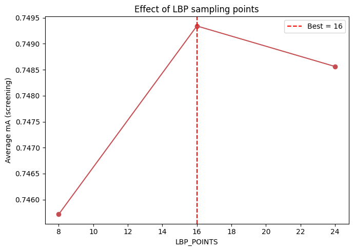

# LBP Sampling Points Sensitivity Analysis

An analysis of the effects of the number of LBP sampling points (`LBP_POINTS`) used for region-based texture feature extraction in the Pure SVM age classification baseline on the PETA dataset.

## Experiment Configuration
- **Tested Values:** `8, 16, 24`
- **Evaluation:** Average mA (screening) recorded for each value on a 30% subsample of the training and validation data, holding the previously chosen region count (`N_REGIONS=4`) and color bin count (`COLOR_BINS=16`) fixed.

## Observations

- **8 to 16 Points (Improvement):**
  Accuracy rose from 8 points (**0.7455**) to its peak at 16 points (**0.7493**).

- **16 to 24 Points (Slight Decline):**
  Accuracy dipped slightly at 24 points (**0.7486**).

- **Analysis:**
  The gain from 8 to 16 points suggests the coarser texture descriptor was missing some discriminative detail, while the marginal decline at 24 points indicates the descriptor has reached a point of diminishing returns, adding more sensitivity to noise than genuine texture signal.

## Effect Visualization

Below is the accuracy trend across the tested LBP sampling point counts:

---

## Conclusion & Recommendation

> [!IMPORTANT]
> **Optimal Value: `16`**
>
> A sampling point count of 16 achieves the highest screening accuracy (0.7493), balancing sufficient texture detail against added sensitivity to noise.
