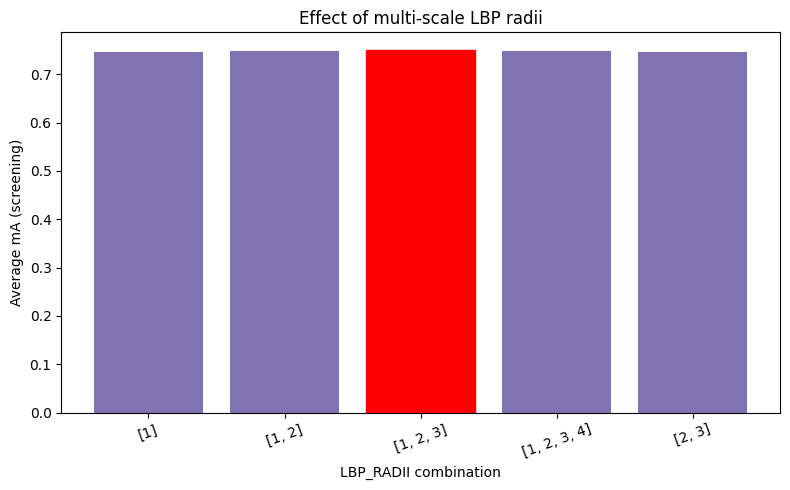

# Multi-scale LBP Radii Sensitivity Analysis

An analysis of the effects of the multi-scale LBP radii combination (`LBP_RADII`) used for region-based texture feature extraction in the Pure SVM age classification baseline on the PETA dataset.

## Experiment Configuration
- **Tested Values:** `[1]`, `[1,2]`, `[1,2,3]`, `[1,2,3,4]`, `[2,3]`
- **Evaluation:** Average mA (screening) recorded for each combination on a 30% subsample of the training and validation data, holding the previously chosen region count (`N_REGIONS=4`), color bin count (`COLOR_BINS=16`), and LBP sampling points (`LBP_POINTS=16`) fixed.

## Observations

- **Tight Clustering Across All Combinations:**
  All five radius combinations produced very similar scores, clustering tightly together with no combination showing a clear or substantial advantage over the others.

- **Best Combination:**
  `[1,2,3]` scored marginally highest among them and was selected as the winning configuration.

- **Analysis:**
  The narrow spread across all five combinations suggests the model's performance is not strongly sensitive to which specific radii are included, only that at least one scale is present.

## Effect Visualization

Below is the accuracy comparison across the tested radii combinations:

---

## Conclusion & Recommendation

> [!IMPORTANT]
> **Optimal Value: `[1, 2, 3]`**
>
> While all tested radii combinations perform similarly, `[1, 2, 3]` is recommended as it scores marginally highest, offering a good balance of scales for multi-scale texture extraction.
