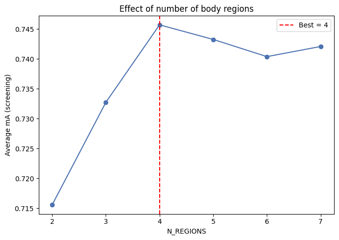

# Number of Body Regions Sensitivity Analysis

An analysis of the effects of the number of body regions (`N_REGIONS`) used for region-based color and texture histogram extraction in the Pure SVM age classification baseline on the PETA dataset.

## Experiment Configuration
- **Tested Values:** `2, 3, 4, 5, 6, 7`
- **Evaluation:** Average mA (screening) recorded for each value on a 30% subsample of the training and validation data, with all other feature settings held at their defaults.

## Observations

- **2 to 4 Regions (Sharp Improvement):**
  Accuracy rose sharply from 2 regions (**0.7155**) to 3 regions (**0.7327**), then rose again to reach its peak at 4 regions (**0.7457**). This reflects the added spatial precision gained from finer body slicing.

- **5 to 7 Regions (Plateau and Decline):**
  Beyond the peak, accuracy declined and settled into a plateau across 5, 6, and 7 regions (**0.7432**, **0.7404**, **0.7420** respectively).

- **Analysis:**
  The decline past 4 regions suggests that additional slicing beyond this point begins fragmenting each region into strips too thin to produce reliable color and texture histograms, adding noise rather than useful detail.

## Effect Visualization

Below is the accuracy trend across the tested region counts:

---

## Conclusion & Recommendation

> [!IMPORTANT]
> **Optimal Value: `4`**
>
> A region count of 4 achieves the highest screening accuracy (0.7457) while avoiding the noise introduced by over-fragmenting each body region at higher region counts.
