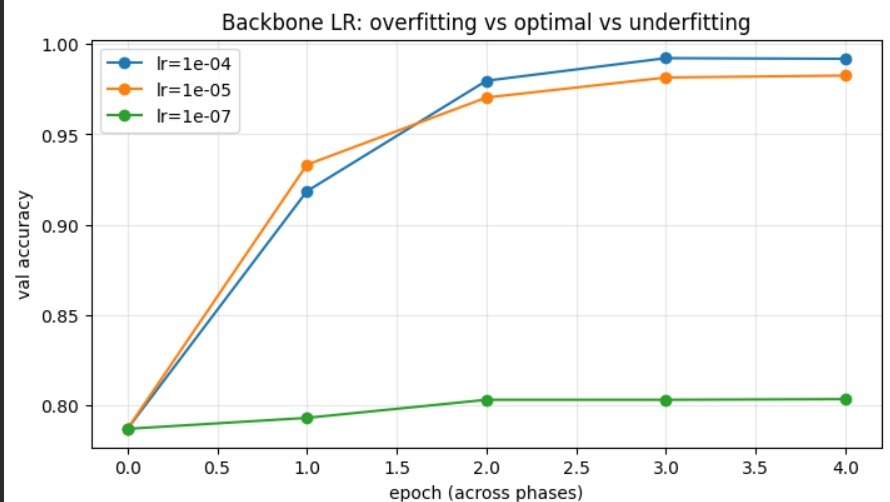

# Backbone Learning Rate Sensitivity Analysis

An analysis of the effects of different backbone learning rates during Stage 1 training on the ViT-B/16 model using the PETA dataset.

## Experiment Configuration
- **Tested Values:** `1e-4`, `1e-5`, `1e-7`
- **Training Schedule:** 1 epoch of linear probing (backbone frozen) followed by 4 epochs of fine-tuning (backbone unfrozen).

## Observations

- **1e-7 (Underfitting):** 
  The `1e-7` learning rate was too low to allow adaptation. The model plateaued early, reaching only **~0.80 validation accuracy**. Because the backbone was effectively frozen by such a small learning rate, it could not adapt its pre-trained ImageNet features to the pedestrian attribute classification task.
  
- **1e-4 & 1e-5 (Convergence):**
  Both `1e-4` and `1e-5` learning rates converged to high accuracy levels:
  - `1e-4` reached a final validation accuracy of **0.992** at epoch 4.
  - `1e-5` reached a final validation accuracy of **0.983** at epoch 4.
  
- **Analysis of the Generalization Gap:**
  Although `1e-4` yielded a slightly higher final validation accuracy, there were no visible signs of catastrophic overfitting collapse (which is normally expected with higher learning rates). This is likely due to the short training horizon (4 epochs), which might not be long enough to differentiate their long-term stability.

## Convergence Visualization

Below is the accuracy convergence path for each learning rate configuration:

---

## Conclusion & Recommendation

> [!IMPORTANT]
> **Optimal Value: `1e-5`**
>
> While `1e-4` achieves a slightly higher accuracy peak at epoch 4, `1e-5` is recommended as the optimal choice. It reaches a very similar accuracy level while maintaining a smoother, more stable convergence path, mitigating the risk of sudden overfitting collapse on longer training runs.
