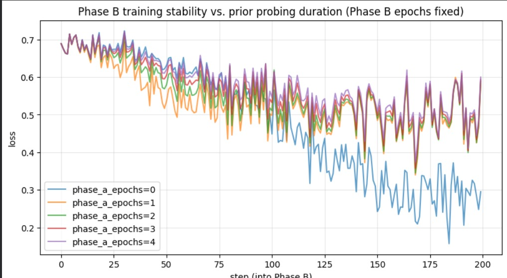
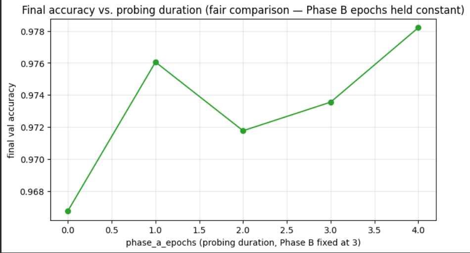

# Linear Probing Duration Sensitivity Analysis

An analysis of the influence of Linear Probing Duration (Phase A epochs) on model stability and convergence during Stage 1 training.

## Experiment Configuration

To isolate the true impact of linear probing duration from the overall fine-tuning budget, the experiment design kept Phase B (full fine-tuning) fixed while varying Phase A (linear probing):
- **Phase B (Full Fine-Tuning):** Fixed at **3 epochs**
- **Phase A (Linear Probing/Backbone Frozen):** Varied `phase_a_epochs` from **0 to 4 epochs** on top of the fixed fine-tuning budget
- **Metrics Tracked:** Step-level training loss for the first 200 steps of Phase B, and final validation accuracy at the end of training.

## Observations

- **Loss Trajectory:**
  Step-level training loss showed that `phase_a_epochs=0` (no probing) converged to a noticeably lower loss than all other configurations, which clustered tightly together at a higher loss. This suggests that skipping the linear probing phase does not destabilize early training in terms of raw training loss.

- **Validation Accuracy & Generalization:**
  While the training loss was lower without probing, the final validation accuracy told the opposite story:
  - **`phase_a_epochs=0`:** **96.8%** (lowest final validation accuracy).
  - **`phase_a_epochs=1`:** **97.6%**.
  - **`phase_a_epochs=2`:** **97.2%** (the non-monotonic dip is likely due to single-run variance).
  - **`phase_a_epochs=3`:** **97.35%**.
  - **`phase_a_epochs=4`:** **97.8%** (highest final validation accuracy).
  
  This indicates that some degree of linear probing is highly beneficial for generalization, even though this effect is not visible in the training-loss trajectory.

## Loss and Accuracy Visualizations

Below is the step-by-step training loss comparison for the first 200 steps of Phase B:

Below is the final validation accuracy comparison for the different probing durations:

---

## Conclusion & Recommendation

> [!IMPORTANT]
> **Optimal Configuration: 4 Probing Epochs**
>
> To optimize validation accuracy and generalization, we recommend using **4 probing epochs**. Linear probing successfully protects pre-trained backbone features from being contaminated by large initial gradients from the random classification head, leading to a significant increase in final validation accuracy (97.8% vs. 96.8% with no probing).
