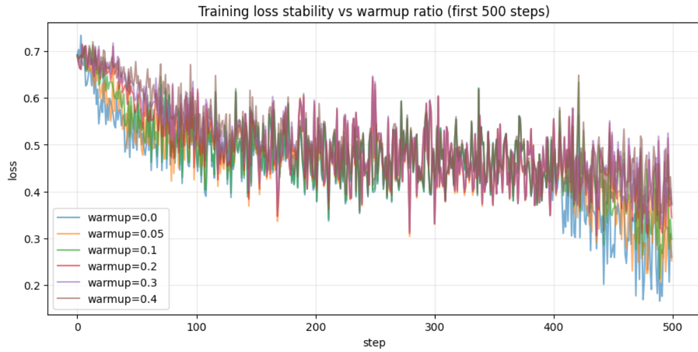
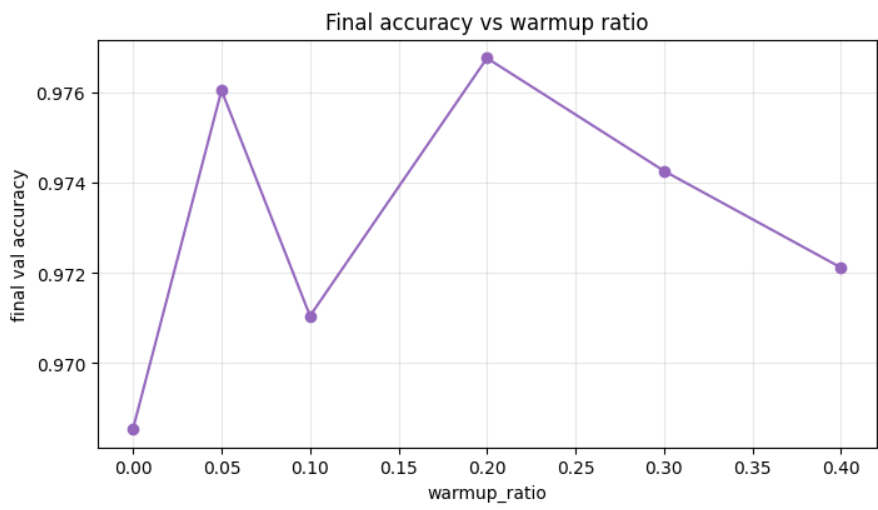

# Warmup Ratio Sensitivity Analysis

An analysis of the influence of different learning rate warmup ratios on early training loss trends and final validation accuracy during Stage 1 training.

## Experiment Configuration

- **Tested Values:** `0.0`, `0.05`, `0.1`, `0.2`, `0.3`, `0.4`
- **Metrics Tracked:** 
  1. Step-by-step training loss for the first 500 steps of the fine-tuning procedure.
  2. Final validation accuracy recorded at the end of training.

## Observations

- **Step-level Loss Trajectory:**
  All six setups exhibited considerable noise at each step, with their step-level loss curves frequently intersecting. The step-level loss trajectory alone did not show any visible separation or clear trend between different warmup ratios.

- **Validation Accuracy Trends:**
  While the early loss curves were indistinguishable, the final validation accuracy revealed a clearer pattern:
  - **`warmup = 0.0` (No Warmup):** Produced the lowest accuracy of all six configurations tested (**~96.9%**).
  - **Nonzero Warmup Ratios (`0.05` to `0.4`):** Clustered noticeably higher, ranging between **~97.1% and 97.7%**.
  - **`warmup = 0.2`:** Achieved the highest final validation accuracy (**97.68%**).
  - **`warmup = 0.05`:** Followed closely at **97.61%**.
  
  This demonstrates that incorporating some degree of warmup is highly beneficial to the model's final performance compared to no warmup at all, even though the effect is not visible in early training loss trajectories.
  
  *Note: The differences among the nonzero values below 0.2 are small and less consistent; repeated runs across multiple random seeds would be beneficial to establish the ranking with absolute confidence.*

## Loss and Accuracy Visualizations

Below is the step-by-step training loss recorded for the first 500 steps of fine-tuning:

Below is the final validation accuracy comparison for the different warmup ratios:

---

## Conclusion & Recommendation

> [!IMPORTANT]
> **Optimal Value: `0.2`**
>
> We recommend a warmup ratio of **`0.2`** (warming up the learning rate for 20% of the total training steps). This provides a robust transition phase that prevents early gradient instability and yields the highest final validation accuracy (97.68%).
