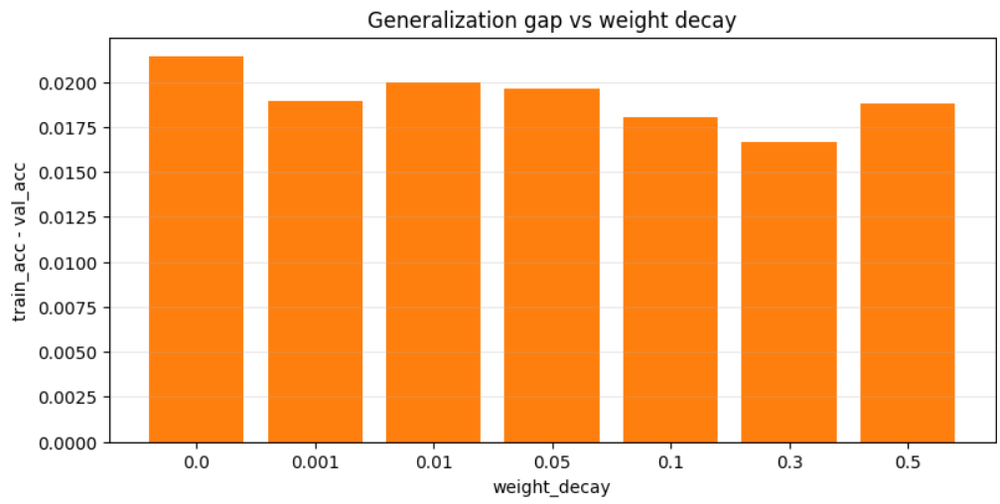
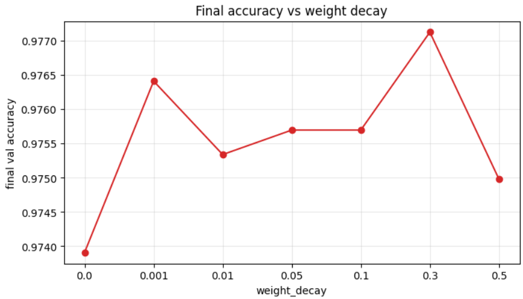

# Weight Decay Sensitivity Analysis

An analysis of the effects of various weight decay values on the generalization gap and validation accuracy during Stage 1 training.

## Experiment Configuration

- **Tested Values:** `0.0`, `0.001`, `0.01`, `0.05`, `0.1`, `0.3`, `0.5`
- **Training Schedule:** 1 epoch of linear probing followed by 3 epochs of fine-tuning (4 epochs total).
- **Metrics Measured:** 
  1. The generalization gap (the difference between training accuracy and validation accuracy at the final epoch).
  2. Final validation accuracy.

## Observations

- **Generalization Gap Trend:**
  The generalization gap showed a mild downward trend as weight decay increased:
  - It dropped from its highest value at `weight_decay=0.0` (~0.0214) to its lowest at `weight_decay=0.3` (~0.0167).
  - It rose again slightly at `weight_decay=0.5` (~0.0188).
  
  While the overall range across all seven values remained fairly narrow (~0.0167–0.0214), this behavior is highly consistent with the expected regularizing effect of weight decay.

- **Validation Accuracy Performance:**
  Final validation accuracy showed a corresponding non-monotonic pattern:
  - **`weight_decay=0.3`:** **97.71%** (highest final accuracy).
  - **`weight_decay=0.001`:** **97.64%**.
  - **`weight_decay=0.01`, `0.05`, `0.1`:** Clustered closely together between **97.53% and 97.57%**.
  - **`weight_decay=0.5`:** Declined slightly to **97.50%** (suggesting that excessive regularization constraints model capacity).
  - **`weight_decay=0.0`:** **97.39%** (lowest final accuracy).
  
  The lowest accuracy occurring at `0.0` reinforces that incorporating regularization benefits generalization relative to using none at all. 

- **Consistency:**
  Notably, `weight_decay=0.3` produced both the lowest generalization gap and the highest final validation accuracy, making it the most consistent performer across both metrics.

## Generalization Gap and Accuracy Visualizations

Below is the generalization gap trend (training accuracy minus validation accuracy) across the tested weight decay values:

Below is the final validation accuracy comparison for the different weight decay values:

---

## Conclusion & Recommendation

> [!IMPORTANT]
> **Optimal Value: `0.3`**
>
> We will adopt a weight decay of **`0.3`** for Stage 1 training. This value achieved the best balance in our sensitivity analysis, producing the smallest generalization gap (~0.0167) and the highest final validation accuracy (97.71%) by effectively regularizing the network without over-constraining its capacity.
